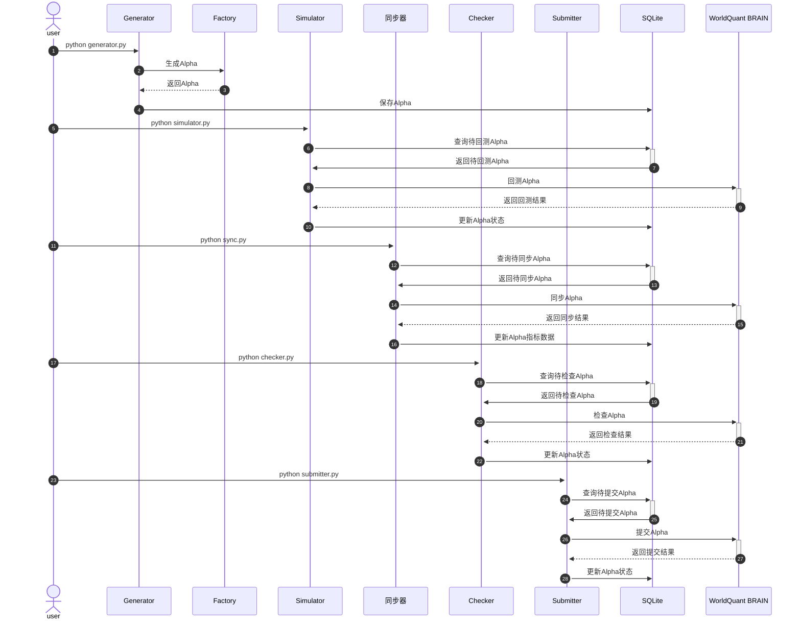

# world-quant-brain

## 介绍

使用[wqb](https://github.com/rocky-d/wqb/)框架搭建的[WorldQuant BRAIN](https://platform.worldquantbrain.com/)工具
## 使用说明

```bash
python main.py
```

## 流程图

```mermaid
sequenceDiagram
    autonumber
    actor user
    participant Generator
    participant factory as Factory
    participant s as Simulator
    participant sync as 同步器
    participant Checker
    participant Submitter
    participant db as SQLite
    participant wq as WorldQuant BRAIN

    user->>Generator: python generator.py
    Generator->>factory: 生成Alpha
    factory-->>Generator: 返回Alpha
    Generator->>db: 保存Alpha


    user->>+s: python simulator.py
    s->>+db: 查询待回测Alpha
    db->>-s: 返回待回测Alpha
    s->>+wq: 回测Alpha
    wq -->>-s: 返回回测结果
    s->>db: 更新Alpha状态

    user ->>+sync: python sync.py
    sync->>+db: 查询待同步Alpha
    db->>-sync: 返回待同步Alpha
    sync->>+wq: 同步Alpha
    wq -->>-sync: 返回同步结果
    sync->>db: 更新Alpha指标数据

    user->>+Checker: python checker.py
    Checker->>+db: 查询待检查Alpha
    db->>-Checker: 返回待检查Alpha
    Checker->>+wq: 检查Alpha
    wq -->>-Checker: 返回检查结果
    Checker->>db: 更新Alpha状态

    user ->>+Submitter: python submitter.py
    Submitter->>+db: 查询待提交Alpha
    db->>-Submitter: 返回待提交Alpha
    Submitter->>+wq: 提交Alpha
    wq -->>-Submitter: 返回提交结果
    Submitter->>db: 更新Alpha状态
```