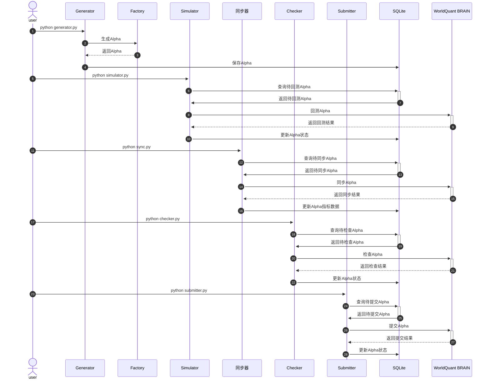

# world-quant-brain

## 介绍
world-quant-brain 是一个用于[WorldQuantBRAIN](https://platform.worldquantbrain.com/)量化金融研究的工具集，专注于生成、测试和提交alpha因子。该项目旨在帮助用户发现具有潜在盈利能力的交易信号，并通过一系列验证步骤确保其稳健性。

## 使用说明

### 主要组件

#### `Generator`
生成alpha因子的工厂类，支持多种生成策略。


#### `Simulator`
模拟alpha因子的表现，评估其在实际交易中的潜力。

#### `Checker`
提供对alpha因子的本地和服务器端检查功能，确保其符合质量标准。

#### `Submitter`
提交经过验证的alpha因子到服务器，支持异步提交和失败重试机制。

#### `ExportFiles`
导出数据集、操作符和alpha因子信息到文件中，便于分享和存档。

#### `RobustTester`
用于对alpha因子进行稳健性测试。主要功能包括定位alpha因子、构建模拟数据列表、获取alpha数据、绘制结果图表以及运行测试。

### 安装依赖
确保安装了以下依赖：
```bash
pip install -r requirements.txt
python main.py
```
### 运行流程


### 贡献指南
欢迎贡献代码和文档。请遵循以下步骤：
1. Fork 项目。
2. 创建新分支。
3. 提交更改。
4. 创建 Pull Request。

### 许可证
该项目遵循 MIT 许可证。详情请查看 LICENSE 文件。